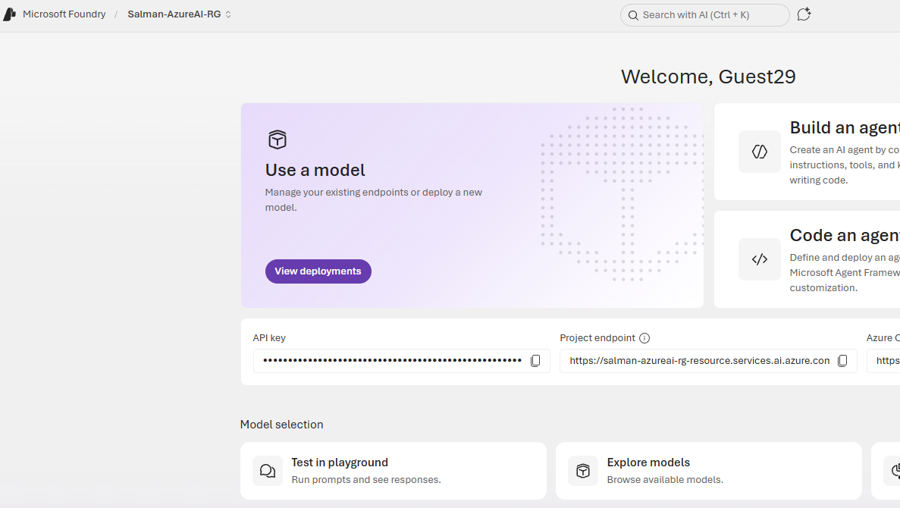
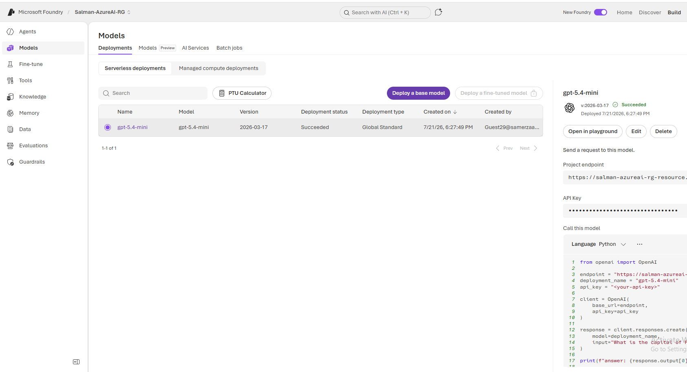
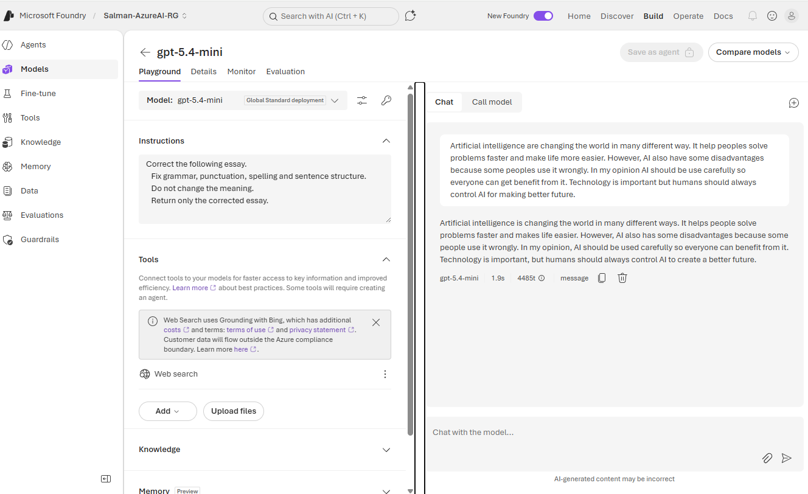
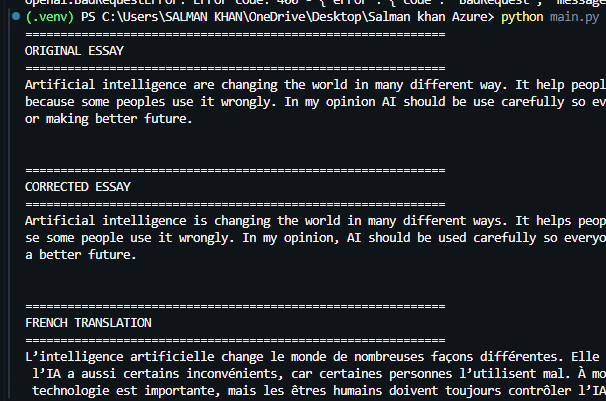

<div align="center">

# ✨ InkPilot

**An AI-powered writing assistant that corrects grammar and translates text into French — built on Azure AI Foundry and GPT-5.4-mini.**

[](https://www.python.org/)
[](https://ai.azure.com/)
[](https://github.com/openai/openai-python)
[](LICENSE)

[Overview](#-overview) •
[Features](#-features) •
[Demo](#-demo) •
[Getting Started](#-getting-started) •
[Usage](#-usage) •
[Screenshots](#-screenshots)

</div>

---

## 📖 Overview

InkPilot takes a rough, error-filled piece of writing and turns it into a clean, publication-ready essay — then translates it into French — using a GPT-5.4-mini model deployed on **Azure AI Foundry**. It's a small end-to-end demonstration of how cloud-hosted LLMs can be wired into a real Python application: from resource provisioning in Azure, to a working CLI tool, to a version-controlled GitHub repo.

## 🚀 Features

| | |
|---|---|
| ✅ | Grammar correction |
| ✅ | Spelling correction |
| ✅ | Punctuation & sentence structure cleanup |
| 🌍 | French translation |
| 🔒 | Secure credential handling via environment variables |
| ⚡ | Runs entirely from the command line |

## 🧰 Tech Stack

- **Language:** Python 3.11
- **AI Platform:** Azure AI Foundry
- **Model:** GPT-5.4-mini
- **SDK:** OpenAI Python SDK
- **Config:** python-dotenv
- **Version Control:** Git & GitHub

## 🎬 Demo

```text
============================================================
ORIGINAL ESSAY
============================================================
Artificial intelligence are changing the world in many different way...

============================================================
CORRECTED ESSAY
============================================================
Artificial intelligence is changing the world in many different ways...

============================================================
FRENCH TRANSLATION
============================================================
L'intelligence artificielle change le monde de nombreuses façons différentes...
```

## 📂 Project Structure

```
InkPilot/
│
├── main.py              # Core script — reads, corrects, and translates the essay
├── essay.txt             # Sample essay with intentional errors
├── requirements.txt       # Python dependencies
├── README.md
├── .gitignore
└── .env                   # Azure credentials (not committed)
```

## 🏁 Getting Started

### 1. Clone the repository

```bash
git clone https://github.com/Salman-Sensei/InkPilot.git
cd InkPilot
```

### 2. Create and activate a virtual environment

```bash
python -m venv .venv
```

**PowerShell:**
```powershell
.\.venv\Scripts\Activate.ps1
```

### 3. Install dependencies

```bash
pip install -r requirements.txt
```

### 4. Configure environment variables

Create a `.env` file in the project root:

```env
AZURE_OPENAI_ENDPOINT=YOUR_ENDPOINT
AZURE_OPENAI_API_KEY=YOUR_API_KEY
AZURE_OPENAI_DEPLOYMENT=gpt-5.4-mini
```

> ⚠️ `.env` is listed in `.gitignore` — never commit real credentials.

## ▶️ Usage

```bash
python main.py
```

The script will read `essay.txt`, correct it using the deployed GPT-5.4-mini model, translate the corrected version into French, and print all three versions to the terminal.

## 🖼️ Screenshots

<div align="center">

### Azure AI Hub


### GPT-5.4-mini Deployment


### Testing in Playground


### Terminal Output


</div>

## 🎓 What I Learned

- Provisioning and structuring resources in Azure AI Foundry (Hub → Project → Deployment)
- Deploying and calling a hosted LLM through the OpenAI Python SDK
- Prompt engineering for reliable, task-specific outputs
- Managing secrets safely with environment variables and `.gitignore`
- Standard Git/GitHub workflow for a real project

## 🔭 Future Improvements

- [ ] Web interface using Streamlit
- [ ] Support for additional target languages
- [ ] PDF upload support
- [ ] Multiple translation style options
- [ ] Grammar quality scoring

## 👤 Author

**Salman Khan**
Software Engineering Student
[GitHub — @Salman-Sensei](https://github.com/Salman-Sensei)

</div>
